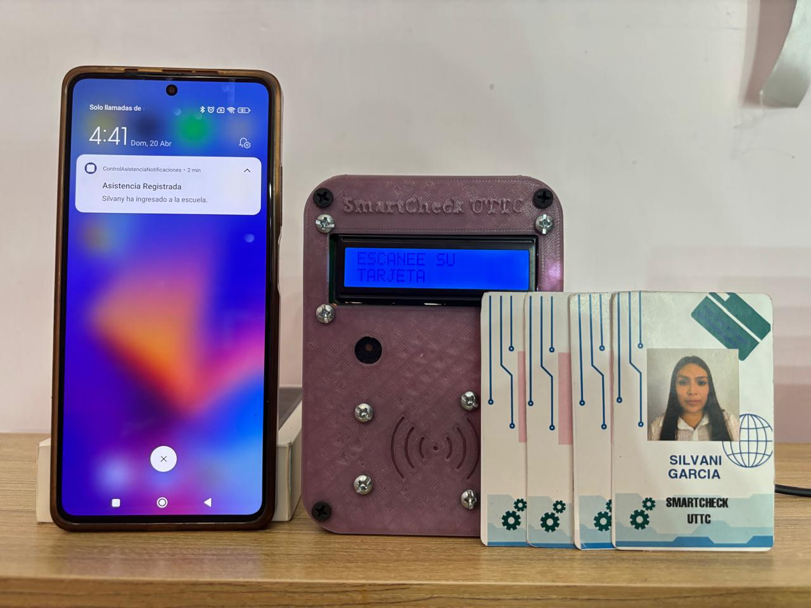
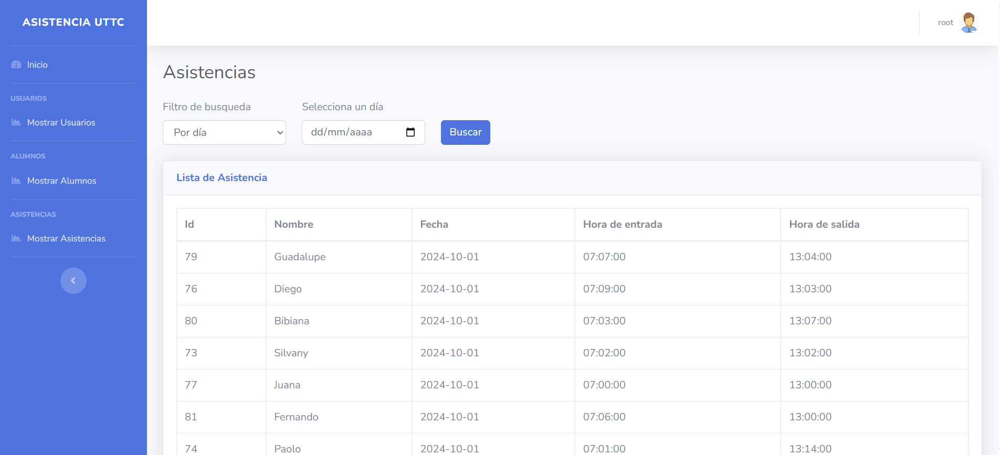
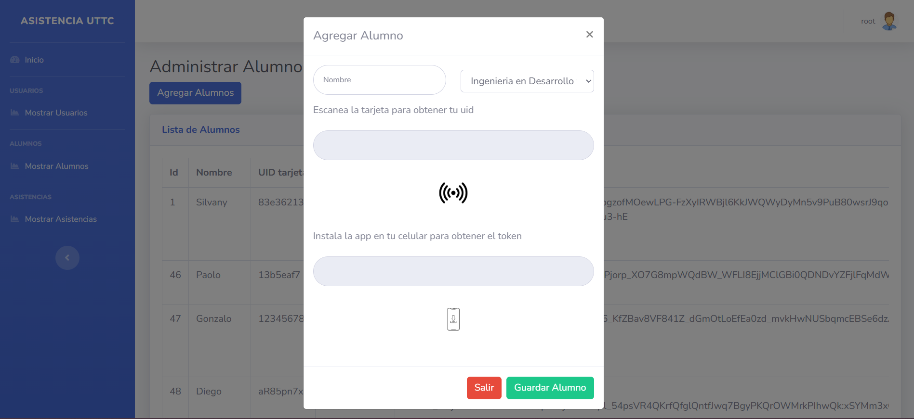

#  Sistema de Control de Asistencia RFID con Notificaciones Push

Proyecto de asistencia escolar que utiliza el microcontrolador **ESP32** para el registro de entradas y salidas de alumnos, con notificaciones **push en tiempo real a los padres** mediante una **app Android**. Incluye un sistema web de administración para gestionar los alumnos y sus asistencias.

## 🔧 Tecnologías utilizadas
- PHP en MVC
- MySQL
- HTML
- Bootstrap
- JavaScript
- Android (Java)
- Libreria
    - SweetAlert2
- Plantilla para web
  - SBAdmin2
- API
   -  Firebase Cloud Messaging (FCM)

##  Aplicación Android
archivo: **ControlAsistenciaNotificaciones**
- Registro de token del dispositivo por padre
- Recepción de notificaciones push
- Sincronización con FCM (HTTP V1 API)

##  Código Arduino 
archivo: **control_asistencia_rfid**

Lenguaje: C++ con Arduino IDE  
Componentes:
- Microcontrolador ESP32
- RFID RC522
- LCD 16x2 con I2C
- Buzzer
- Librerías:
  - MFRC522
  - LiquidCrystal_I2C
  - HTTPClient (ESP32)
  - WiFi
  
##  ¿Cómo funciona?

### 1. Alumno escanea su tarjeta RFID
- El ESP32 lee el UID de la tarjeta
- Se muestra mensaje en la **pantalla LCD** y suena el **buzzer**
- Se realiza una petición HTTP POST al servidor PHP
- El sistema valida si está en **modo registro** o **modo asistencia**

### 2.  Registro en la base de datos
- Si es **modo 1 (asistencia)**: se guarda la entrada/salida del alumno
  
- Si es **modo 2 (registro de alumnos)**: se guarda el UID para completar el formulario desde el panel
    - Se descarga la aplicacion en el padre del alumno para insertar automaticamente el Token y posteriormente lleguen las notificaciones
  

### 3.  Notificación push al padre 📳
- El sistema consulta el token del padre desde MySQL
- Se envía una notificación vía **Firebase Cloud Messaging**
- El padre recibe un mensaje tipo:  
  `Silvany ha ingresado a la escuela`

